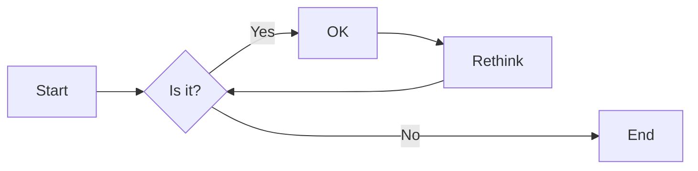
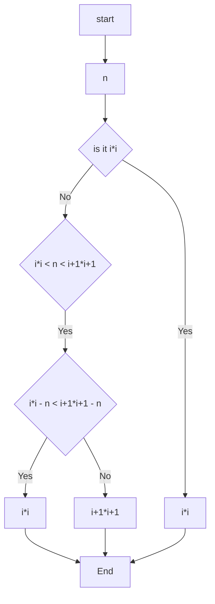
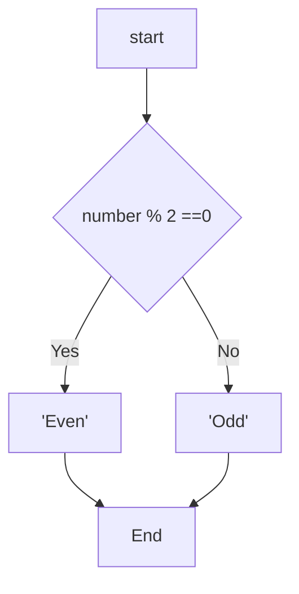
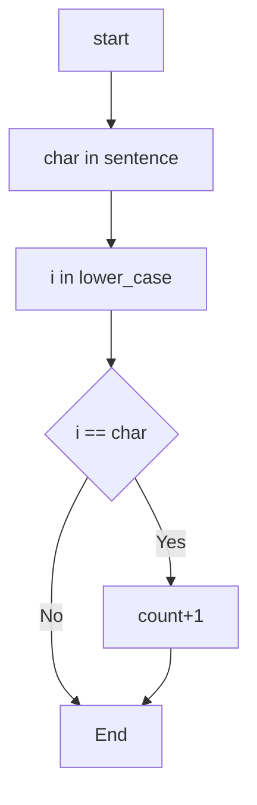

# 实验二 Python变量、简单数据类型

班级： 21计科03班

学号： 20210302327  

姓名： 廖超逸

Github地址：<https://github.com/Licife/python_course>

CodeWars地址：<https://www.codewars.com/users/Licifer>

---

## 实验目的

1. 使用VSCode编写和运行Python程序
2. 学习Python变量和简单数据类型

## 实验环境

1. Git
2. Python 3.10
3. VSCode
4. VSCode插件

## 实验内容和步骤

### 第一部分

实验环境的安装

1. 安装Python，从Python官网下载Python 3.10安装包，下载后直接点击可以安装：[Python官网地址](https://www.python.org/downloads/)
2. 为了在VSCode集成环境下编写和运行Python程序，安装下列VScode插件
   - Python
   - Python Environment Manager
   - Python Indent
   - Python Extended
   - Python Docstring Generator
   - Jupyter
   - indent-rainbow
   - Jinja

---

### 第二部分

Python变量、简单数据类型和列表简介

完成教材《Python编程从入门到实践》下列章节的练习：
- 第2章 变量和简单数据类型
---

### 第三部分

在[Codewars网站](https://www.codewars.com)注册账号，完成下列Kata挑战：

---

#### 第1题：求离整数n最近的平方数（Find Nearest square number）

难度：8kyu

你的任务是找到一个正整数n的最近的平方数
例如，如果n=111，那么nearest_sq(n)（nearestSq(n)）等于121，因为111比100（10的平方）更接近121（11的平方）。
如果n已经是完全平方（例如n=144，n=81，等等），你需要直接返回n。
代码提交地址
<https://www.codewars.com/kata/5a805d8cafa10f8b930005ba>

---

#### 第2题：弹跳的球（Bouncing Balls）

难度：6kyu

一个孩子在一栋高楼的第N层玩球。这层楼离地面的高度h是已知的。他把球从窗口扔出去。球弹了起来,  例如:弹到其高度的三分之二（弹力为0.66）。他的母亲从离地面w米的窗户向外看,母亲会看到球在她的窗前经过多少次（包括球下落和反弹的时候）？

一个有效的实验必须满足三个条件：

- 参数 "h"（米）必须大于0
- 参数 "bounce "必须大于0且小于1
- 参数 “window "必须小于h。

如果以上三个条件都满足，返回一个正整数，否则返回-1。
**注意:只有当反弹球的高度严格大于窗口参数时，才能看到球。**
代码提交地址
<https://www.codewars.com/kata/5544c7a5cb454edb3c000047/train/python>

---

#### 第3题： 元音统计(Vowel Count)

难度： 7kyu

返回给定字符串中元音的数量（计数）。对于这个Kata，我们将考虑a、e、i、o、u作为元音（但不包括y）。输入的字符串将只由小写字母和/或空格组成。

代码提交地址：
<https://www.codewars.com/kata/54ff3102c1bad923760001f3>

---

#### 第4题：偶数或者奇数（Even or Odd）

难度：8kyu

创建一个函数接收一个整数作为参数，当整数为偶数时返回”Even”当整数位奇数时返回”Odd”。
代码提交地址：
<https://www.codewars.com/kata/53da3dbb4a5168369a0000fe>

### 第四部分

使用Mermaid绘制程序流程图

安装Mermaid的VSCode插件：

- Markdown Preview Mermaid Support
- Mermaid Markdown Syntax Highlighting

使用Markdown语法绘制你的程序绘制程序流程图（至少一个），Markdown代码如下：

[](https://imgse.com/i/pPoKBgf)

显示效果如下：



查看Mermaid流程图语法-->[点击这里](https://mermaid.js.org/syntax/flowchart.html)

使用Markdown编辑器（例如VScode）编写本次实验的实验报告，包括[实验过程与结果](#实验过程与结果)、[实验考查](#实验考查)和[实验总结](#实验总结)，并将其导出为 **PDF格式** 来提交。

## 实验过程与结果

请将实验过程与结果放在这里，包括：

- [第二部分 Python变量、简单数据类型和列表简介](#第二部分)

---
**练习 2.1: 简单消息 将一条消息赋给变量 并将其打印出来**
```python
message = input('输入内容:')
print(message)
[](https://imgse.com/i/pPoSPsK)
```
---
**练习 2.2: 多条简单消息 将一条消息赋给变量 并将其打印出来 再将变量的值修改为一条新消息 并将其打印出来**

```python
message = input('输入内容:')
print(message)
message = input('请再次输入内容:')
print(message)
```
[](https://imgse.com/i/pPoSBeU)
```


**个性化消息 用变量表示一个人的名字 并向其显示一条消息 显示的消息应非常简单 如下所示 Hello Eric, would you like to learn some Python today?**
```python
name = input('输入你的名字:')
name_len = len(name)
len1 = 0
for char in name:
    if not char.isdigit():
        len1 = len1 + 1
    else:
        name2 = input('请重新输入你的名字:')
        continue
if len1 == name_len:
    print('Hello ' + name.title() + ', would you like to learn some Python today?')
```
[](https://imgse.com/i/pPopnk4)

**练习 2.4: 调整名字的大小写 用变量表示一个人的名字 在分别以全大写 全小写和首字母大写的方式显示这个人名**
```python
name = input('请输入你的名字:')
print(name.title())
print(name.upper())
print(name.lower())
[](https://imgse.com/i/pPop3X6)
```

**练习 2.5: 名言1 找到你钦佩的名人说的一句名言 将这个名人的姓名和名言打印出来 算出应类似于下面这样(包括引号) Albert Einstein once said, "A person who never made a mistake never tried anything new"**
```python
name1 = input('请输入名人的名:')
name2 = input('请输入名人的字:')
endorse = input('请输入名人的名言:')
print(f'{name1.title()} {name2.title()} once said, "{endorse}"')
```
[](https://imgse.com/i/pPopsnf)

**练习 2.6: 名言2 重复练习2.5 但用变量famous_person表示名人的姓名 再创建要显示的消息并将其赋值给变量message 然后打印这条消息**
```python
name1 = input('请输入名人的名:')
name2 = input('请输入名人的字:')
famous_person = f"{name1.title()} {name2.title()}"
message = input('请输入名人的名言:')
print(f'{famous_person} once said, "{message}"')
```
[](https://imgse.com/i/pPopsnf)

**练习 2.7 : 生成人名中的空白 用变量表示一个人的名字 并在其开头和末尾都包含一些空白字符 务必至少使用字符组合'\t'和'\n'各一次 打印这个人名显示其开头和末尾的空白 然后 分别使用函数lstrip() rstrip()和strip()对人名进行处理 并将其结果打印出来**
```python
name1 = input('请输入名:')
print('\t' + name1)
name2 = input('请输入字:')
print(name2 + '\n' + 'sdaw')
print('名:' + name1.lstrip() + '\t' + '字:' + name2.rstrip() + 'sdasdas')
print(name1.strip() + name2.strip())
```
[](https://imgse.com/i/pPopvg1)

**练习 2.8: 文件扩展名 Python提供了 removesuffix()方法 其工作原理与 removeprefix() 很像 请将值'python_notes.txt'赋给变量 filename 再使用removesuffix() 方法来显示不包含扩展名的文件名 就像文件浏览器所做的那样**
```python
document = 'python_notes.txt'
document = document.removesuffix('.txt')
print(document)
```
[](https://imgse.com/i/pPo9iUe)

**练习 2-9: 数字8： 编写4个表达 分别使用加法 减法 乘法和除法运算 但结果都是数字8为了使用函数调用print()来显示结果 务必将这些表达式用括号括起来 也就是说 你应该编写4行类似于下面的代码print(5 + 3)输出应为4行 其中每行都只包括数字8**
```python
print(5 + 3)
print(10 - 2)
print(16 // 2)
print(4 * 2)
```
[](https://imgse.com/i/pPo9nDf)

**练习 2-10: 最喜欢的数字 用一个变量来表示你最喜欢的数 再使用这个变量创建一条消息 指出你最喜欢的数字是什么 然后将这条消息打印出来**
```python
number = 10
message = f'My favorite is {str(number)}'
print(message)
```
[](https://imgse.com/i/pPo9QUg)

**练习 2-10: 添加注释 选择你编写的两个程序 在每个程序中都至少添加一条注释 如果程序太简单 实在没有什么需要说明的**
```python
就在程序文件开头加上你的姓名和当前日期 再用一句话阐述程序的功能
廖超逸 2023-09-22
没有什么用
```
[](https://imgse.com/i/pPo9yx1)

**练习 2.12: Python之禅 再Pyhton终端会话中最新命令 import this 并粗略地浏览一下其他指导原则**
```python
import this
```
[](https://imgse.com/i/pPo95PH)

- [第三部分 Codewars Kata挑战](#第三部分)
---

#### 第1题：求离整数n最近的平方数（Find Nearest square number）

难度：8kyu

你的任务是找到一个正整数n的最近的平方数
例如，如果n=111，那么nearest_sq(n)（nearestSq(n)）等于121，因为111比100（10的平方）更接近121（11的平方）。
如果n已经是完全平方（例如n=144，n=81，等等），你需要直接返回n。
```python
def nearest_sq(n):
    for i in range(1, n + 1):
        if n == i*i:
            return n
        if i * i < n < (i + 1) * (i + 1):
            if abs((i * i - n)) < ((i + 1) * (i + 1) - n):
                return (i * i)
            else:
                return ((i + 1) * (i + 1))
```
[](https://imgse.com/i/pPoleHg)

---
#### 第2题：弹跳的球（Bouncing Balls）

难度：6kyu

一个孩子在一栋高楼的第N层玩球。这层楼离地面的高度h是已知的。他把球从窗口扔出去。球弹了起来,  例如:弹到其高度的三分之二（弹力为0.66）。他的母亲从离地面w米的窗户向外看,母亲会看到球在她的窗前经过多少次（包括球下落和反弹的时候）？

一个有效的实验必须满足三个条件：

- 参数 "h"（米）必须大于0
- 参数 "bounce "必须大于0且小于1
- 参数 “window "必须小于h。

如果以上三个条件都满足，返回一个正整数，否则返回-1。
**注意:只有当反弹球的高度严格大于窗口参数时，才能看到球。**
```python
def bouncing_ball(h, bounce, window):
    count = 1
    if h > 0 and 0 < bounce < 1 and window < h:
        if h * bounce <= window:
            return count
        else:
            while h * bounce >= window:
                count += 2
                h = h*bounce
            return count
    else:
        return -1
```
[](https://imgse.com/i/pPoljGn)

---

#### 第3题： 元音统计(Vowel Count)

难度： 7kyu

返回给定字符串中元音的数量（计数）。对于这个Kata，我们将考虑a、e、i、o、u作为元音（但不包括y）。输入的字符串将只由小写字母和/或空格组成。
```python
def get_count(sentence):
    count = 0
    lower_case = ['a', 'e', 'i', 'o', 'u']
    for char in sentence:
        for i in lower_case:
            if char == i:
                count += 1
    return count
```
[](https://imgse.com/i/pPo1UL8)
---

#### 第4题：偶数或者奇数（Even or Odd）

难度：8kyu

创建一个函数接收一个整数作为参数，当整数为偶数时返回”Even”当整数位奇数时返回”Odd”。
```python
def even_or_odd(number):
    if numbrt % 2 == 0:
        return "Even"
    else:
        return "Odd"
```
[](https://imgse.com/i/pPo1WeU)
---
- [第四部分 使用Mermaid绘制程序流程图](#第四部分)
---
第三部分 第一题

    A[start] --> B[n]
    B --> C{is it i*i}
    C --> |Yes| D[i*i]
    C --> |No| E{i*i < n <  i+1*i+1}
    E --> |Yes| F{i*i - n < i+1*i+1 - n}
    F --> |Yes| G[i*i]
    F --> |No| H[i+1*i+1]
    G --> I[End]
    H --> I[End]
    D --> I[End]

---
第三部分 第四题

flowchart TD
    A[start] --> B{number % 2 ==0 }
    B --> |Yes| C['Even']
    B --> |No| D['Odd']
    C --> E[End]
    D --> E[End]

第三部分 第三题

flowchart TD
    A[start] --> B[char in sentence]
    B --> C[i in lower_case]
    C --> D{i == char}
    D --> |Yes| E[count+1]
    D --> |No| F
    E --> F[End]

---
## 实验考查

请使用自己的语言并使用尽量简短代码示例回答下面的问题，这些问题将在实验检查时用于提问和答辩以及实际的操作。

1. Python中的简单数据类型有那些？我们可以对这些数据类型做哪些操作？
Python中的简单数据类型int float bool str list tuple set dist
对 int float 数据类型进行加减乘除等运算
对 bool 数据类型进行逻辑运算
对 str 数据类型进行拼接 切片 索引 查找 替换 大小写转换等操作
对 set 数据类型进行增删改查等的操作
对 dist 数据类型进行增删改查等的操作
2. 为什么说Python中的变量都是标签？
变量是对内存中对象的引用 当创建一个变量并赋值给一个对象时 是将变量指向了该对象所在的内存地址 
3. 有哪些方法可以提高Python代码的可读性？
写注释 代码规范化 变量命名意义化

## 实验总结

学会了Python的基本语法使用 也了解了其简单数据类型的语法与基本操作 也学会了Python中的函数命名与使用 学会了Pycharm的使用 学会了mermaid 语法
